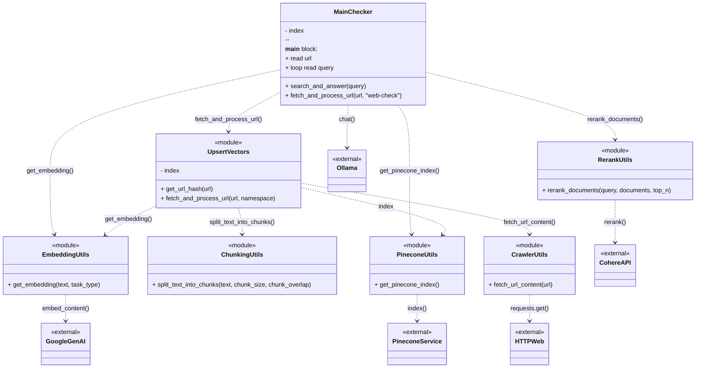

# RAG API 產品搜尋服務

這是一個基於 **向量檢索（Retrieval-Augmented）** 技術的產品語意搜尋 API，使用 Flask 框架建構，提供智慧化的產品搜尋功能。

> **注意**：此 API **僅包含檢索（Retrieval）部分，不包含生成（Generation）**。也就是說，這是一個 **RA（Retrieval-Augmented）** 系統，而非完整的 RAG 系統。本 API **不使用 Ollama** 或其他 LLM 進行文字生成，僅負責根據查詢找出相關產品並回傳 ID。

## 概述

此 API 接收使用者的自然語言查詢，透過向量相似度搜尋，從 Pinecone 向量資料庫中找出最相關的產品，並回傳產品 ID 列表。**不包含文字生成功能**。

## 技術架構

```
┌─────────────────┐     ┌─────────────────┐     ┌─────────────────┐
│   Frontend      │────▶│   RAG API       │────▶│   Pinecone      │
│   (React)       │     │   (Flask)       │     │   (向量資料庫)   │
└─────────────────┘     └─────────────────┘     └─────────────────┘
                               │
                               ▼
                        ┌─────────────────┐
                        │  Google Gemini  │
                        │  (Embedding)    │
                        └─────────────────┘
```

## API 端點

### POST `/api/search`

搜尋與查詢語句相關的產品。

**Request Body:**
```json
{
  "query": "我想買零食"
}
```

**Response (200 OK):**
```json
["product_id_1", "product_id_2", "product_id_3"]
```

**Error Response (400):**
```json
{
  "error": "Missing 'query' field"
}
```

**Error Response (500):**
```json
{
  "error": "錯誤訊息"
}
```

## 搜尋流程

1. **接收查詢** - 使用者輸入自然語言查詢（如：「我想買零食」）
2. **翻譯處理** - 使用 `deep-translator` 將中文翻譯成英文，組合成雙語查詢
3. **向量化** - 使用 Google Gemini `text-embedding-004` 將查詢轉換為 768 維向量
4. **向量搜尋** - 在 Pinecone 的 `ntou-products` namespace 中進行相似度搜尋
5. **過濾結果** - 過濾掉相似度分數低於 0.5 的結果
6. **回傳 ID** - 提取產品 ID 列表回傳給前端

## 核心檔案

### `src/app.py`
Flask 主應用程式，負責：
- 建立 Flask 應用與 CORS 設定
- 定義 `/api/search` 端點
- 處理請求與回應

### `NTOUutils/ntou_search.py`
搜尋邏輯核心，負責：
- 中英文翻譯（提升搜尋準確度）
- 呼叫 Embedding API
- 執行 Pinecone 向量搜尋
- 過濾與格式化結果

### `utils/embedding_utils.py`
Embedding 工具，負責：
- 呼叫 Google Gemini API
- 將文字轉換為向量

### `utils/pinecone_utils.py`
Pinecone 連線管理，負責：
- 初始化 Pinecone 連線
- 取得 Index 實例

## 專案範圍說明

**重要**：本專案目錄中還包含其他專案的程式碼，這些**不屬於此 RAG API**：

- **`src/main_checker.py`** / **`src/main_checkerpdfmod.py`**：屬於**網頁事實查核專案**，使用完整的 RAG（包含 Ollama LLM 生成）
- **`utils/pdf_utils/`**：屬於** PDF 處理專案**，用於 PDF 文件的向量化與索引
- **`scripts/index.py`**：用於初始化 Pinecone Index，屬於共用工具

**本 RAG API 僅使用以下檔案**：
- `src/app.py`
- `NTOUutils/ntou_search.py`
- `NTOUutils/ntou_embedding.py`（如有的話）
- `utils/embedding_utils.py`
- `utils/pinecone_utils.py`

## 環境變數

需要在 `.env` 檔案中設定以下變數：

```bash
PINECONE_API_KEY=你的_pinecone_api_key
PINECONE_INDEX=你的_index_name
GOOGLE_API_KEY=你的_google_api_key
PORT=5001  # 可選，預設 5001
```

> **注意**：此 API **不需要**以下環境變數（這些是其他專案使用的）：
> - `COHERE_API_KEY`（用於 rerank，本 API 不使用）
> - Ollama 相關設定（本 API 不使用 LLM 生成）

## 本地開發

### 安裝依賴
```bash
cd /Users/jamessu/Desktop/大三上/ragproject
python -m venv .venv
source .venv/bin/activate
pip install -r requirements.txt
```

### 啟動服務
```bash
python src/app.py
```

服務將在 `http://localhost:5001` 啟動。

## 測試 API

使用 curl 測試：
```bash
curl -X POST http://localhost:5001/api/search \
  -H "Content-Type: application/json" \
  -d '{"query": "我想買零食"}'
```

## 部署

### Cloudflare Tunnel

透過 Cloudflare Tunnel 對外公開服務：

```yaml
# cloudflare-tunnel.yml
- hostname: rag-api.jamessu2016.com
  service: http://localhost:5001
```

### Docker

使用 Docker 容器化部署：
```bash
docker build -t rag-api .
docker run -p 5001:5001 --env-file .env rag-api
```

## 一鍵啟動（含前後端）

```bash
/Users/jamessu/Desktop/大三上/ragproject/.venv/bin/pip install -r /Users/jamessu/Desktop/大三上/ragproject/requirements.txt && (cd /Users/jamessu/Desktop/computersciencehomework/SEProject2025Frontend && npm run dev) & (cd /Users/jamessu/Desktop/computersciencehomework/SEProject2025Backend && ./mvnw spring-boot:run) & /Users/jamessu/Desktop/大三上/ragproject/.venv/bin/python /Users/jamessu/Desktop/大三上/ragproject/src/app.py & cloudflared tunnel --config /Users/jamessu/Desktop/大三上/ragproject/cloudflare-tunnel.yml run
```

## 相關服務

| 服務 | 本地端口 | 公開網址 |
|------|----------|----------|
| 前端 | 5173 | davidloman.jamessu2016.com |
| 後端 API | 8080 | api.jamessu2016.com |
| RAG API | 5001 | rag-api.jamessu2016.com |

---

# Local RAG & Web Fact Checker 

這是一個基於 **RAG (Retrieval-Augmented Generation)** 技術的本地化事實查核系統。
它能夠抓取指定的網頁內容，將其向量化並存入資料庫，接著利用本地的 LLM (Ollama) 根據該網頁內容回答你的問題。

## 功能特色

- **隱私安全**：使用本地 LLM (`gemma3:4b` via Ollama)，資料不需傳送給 OpenAI。
- **即時查核**：輸入任意網址 (如新聞、醫療文章)，即時建立索引並進行問答。
- **高精準度**：
  - **Embedding**: 使用 **Google Gemini (`text-embedding-004`)** 進行高品質向量化 (維度 768)。
  - **Rerank**: 使用 **Cohere (`rerank-v3.5`)** 進行頂級的重排序，確保 AI 看到最相關的片段。
- **專業切片**: 使用 Token-based chunking (`RecursiveCharacterTextSplitter`)，確保上下文完整。
- **向量資料庫**: 使用 Pinecone 儲存與檢索向量資料。

##  安裝需求

1. **Python 3.10+**
2. **Ollama** (需安裝並下載模型)
   ```bash
   ollama pull gemma3:4b
   ```
3. **API Keys**:
   - Pinecone (向量資料庫)
   - Google AI Studio (Embedding)
   - Cohere (Reranking)

### 1. 設定環境

建立 `.env` 檔案：
```bash
PINECONE_API_KEY=你的_pinecone_api_key
PINECONE_INDEX=你的_index_name
GOOGLE_API_KEY=你的_google_api_key
COHERE_API_KEY=你的_cohere_api_key
```

安裝 Python 套件：
```bash
python -m venv venv
source venv/bin/activate
# 安裝必要套件:
pip install pinecone google-generativeai cohere requests beautifulsoup4 python-dotenv ollama langchain-text-splitters
```

### 2. 建立資料庫索引 (第一次使用時)

執行 `index.py` 來建立 Pinecone Index (維度 768)：
```bash
python scripts/index.py
```

### 3. 啟動網頁查核機器人

這是本專案的核心功能。執行後，輸入你想查核的網址即可開始對話：
```bash
python src/main_checker.py
./venv/bin/python src/main_checker.py
```

**使用範例：**
1. 輸入網址
2. 程式會自動抓取、切片並存入資料庫
3. 詢問問題
4. 系統會根據網頁內容生成回答

## 專案架構與檔案說明




### 核心應用程式 (`src/`)
- **`main_checker.py`**: **[主程式]** 整合所有功能，提供互動式介面。負責接收使用者網址與問題，協調爬蟲、檢索、重排與生成回答
### 共用工具 (`utils/`)
- **`upsert_vectors.py`**: 資料處理核心。負責協調爬蟲抓取、文字切片、轉向量，最後將資料上傳至 Pinecone
- **`crawler_utils.py`**: 網頁爬蟲工具
- **`chunking_utils.py`**: 文字切片工具。使用 `RecursiveCharacterTextSplitter` 進行 Token-based 切片，確保語意完整
- **`embedding_utils.py`**: Embedding 封裝。呼叫 Google Gemini API 產生向量
- **`rerank_utils.py`**: Rerank 封裝。呼叫 Cohere API 對檢索結果進行二次排序
- **`pinecone_utils.py`**: 資料庫連線管理。統一處理 Pinecone 的初始化與連線

### 輔助腳本 (`scripts/`)
- **`index.py`**: 初始化工具。用於在 Pinecone 上建立正確維度 (768) 的 Index