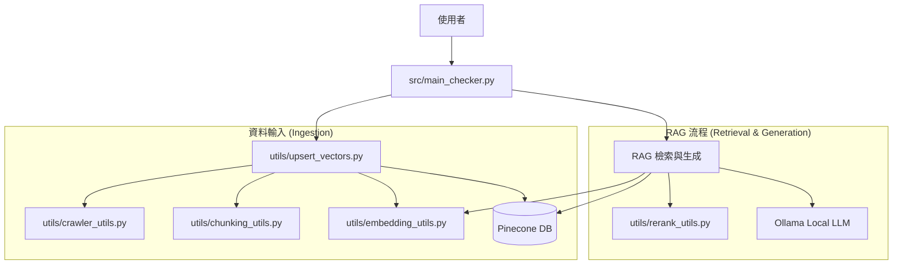

# Local RAG & Web Fact Checker 🕵️‍♂️

這是一個基於 **RAG (Retrieval-Augmented Generation)** 技術的本地化事實查核系統。
它能夠抓取指定的網頁內容，將其向量化並存入資料庫，接著利用本地的 LLM (Ollama) 根據該網頁內容回答你的問題。

## ✨ 功能特色

- **隱私安全**：使用本地 LLM (`gemma3:4b` via Ollama)，資料不需傳送給 OpenAI。
- **即時查核**：輸入任意網址 (如新聞、醫療文章)，即時建立索引並進行問答。
- **高精準度**：
  - **Embedding**: 使用 **Google Gemini (`text-embedding-004`)** 進行高品質向量化 (維度 768)。
  - **Rerank**: 使用 **Cohere (`rerank-v3.5`)** 進行頂級的重排序，確保 AI 看到最相關的片段。
- **專業切片**: 使用 Token-based chunking (`RecursiveCharacterTextSplitter`)，確保上下文完整。
- **向量資料庫**: 使用 Pinecone 儲存與檢索向量資料。

## 🛠️ 安裝需求

1. **Python 3.10+**
2. **Ollama** (需安裝並下載模型)
   ```bash
   ollama pull gemma3:4b
   ```
3. **API Keys**:
   - Pinecone (向量資料庫)
   - Google AI Studio (Embedding)
   - Cohere (Reranking)

## 🚀 快速開始

### 1. 設定環境

複製 `.env.example` (如果有) 或直接建立 `.env` 檔案：
```bash
PINECONE_API_KEY=你的_pinecone_api_key
PINECONE_INDEX=你的_index_name
GOOGLE_API_KEY=你的_google_api_key
COHERE_API_KEY=你的_cohere_api_key
```

安裝 Python 套件：
```bash
python -m venv venv
source venv/bin/activate
# 安裝必要套件:
pip install pinecone google-generativeai cohere requests beautifulsoup4 python-dotenv ollama langchain-text-splitters
```

### 2. 建立資料庫索引 (第一次使用時)

執行 `index.py` 來建立 Pinecone Index (維度 768)：
```bash
python scripts/index.py
```

### 3. 啟動網頁查核機器人

這是本專案的核心功能。執行後，輸入你想查核的網址即可開始對話：
```bash
python src/main_checker.py
```

**使用範例：**
1. 輸入網址：`https://www.cdc.gov/flu/symptoms/coldflu.htm` (CDC 感冒與流感資訊)
2. 程式會自動抓取、切片並存入資料庫。
3. 詢問問題：`請問感冒和流感的主要差別是什麼？`
4. 系統會根據網頁內容生成回答。

## 📂 專案架構與檔案說明



### 核心應用程式 (`src/`)
- **`main_checker.py`**: **[主程式]** 整合所有功能，提供互動式介面。負責接收使用者網址與問題，協調爬蟲、檢索、重排與生成回答。
- **`rag_retrieve.py`**: RAG 流程的獨立測試腳本。不包含爬蟲功能，專門用來測試「檢索 -> 重排 -> 生成」這個核心邏輯是否正常。

### 共用工具 (`utils/`)
- **`upsert_vectors.py`**: 資料處理核心。負責協調爬蟲抓取、文字切片、轉向量，最後將資料上傳至 Pinecone。
- **`crawler_utils.py`**: 網頁爬蟲工具。使用 `requests` 和 `BeautifulSoup` 抓取網頁並清理 HTML 標籤。
- **`chunking_utils.py`**: 文字切片工具。使用 `RecursiveCharacterTextSplitter` 進行 Token-based 切片，確保語意完整。
- **`embedding_utils.py`**: Embedding 封裝。呼叫 Google Gemini API 產生向量。
- **`rerank_utils.py`**: Rerank 封裝。呼叫 Cohere API 對檢索結果進行二次排序。
- **`pinecone_utils.py`**: 資料庫連線管理。統一處理 Pinecone 的初始化與連線。

### 輔助腳本 (`scripts/`)
- **`index.py`**: 初始化工具。用於在 Pinecone 上建立正確維度 (768) 的 Index。

## ⚠️ 注意事項

- 網頁抓取功能依賴 `requests` 與 `BeautifulSoup`，對於動態渲染 (JavaScript) 的網站可能無法完整抓取。
- 請確保 `.env` 檔案中的 API Key 正確無誤。
